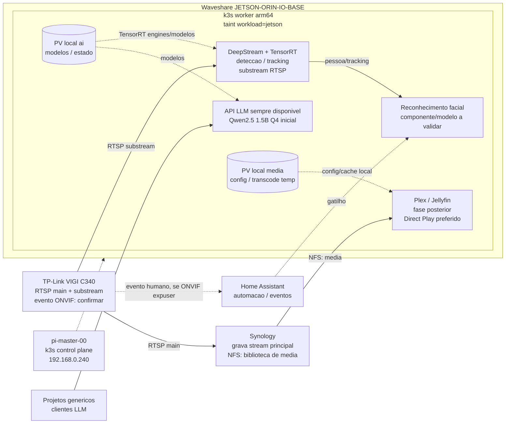

# Jetson Orin Nano Super no cluster k3s

Este guia cobre o caminho desde o primeiro boot do Jetson Orin Nano 8 GB até sua entrada como worker no cluster k3s existente. A integracao inicial mantem o Jetson isolado para workloads ate que cada aplicacao seja escolhida explicitamente.

Comece pela etapa detalhada de [atualizacao de firmware e primeira instalacao](JETSON_ORIN_NANO_FIRMWARE.md). Este guia geral descreve as etapas posteriores de rede, ingresso como worker e integracao dos workloads.

## Como o cluster esta organizado

- `pi-master-00` (`192.168.0.240`) e o Raspberry Pi que hospeda o control plane k3s e exporta os volumes NFS de configuracao e downloads em `/ssd`.
- O Synology (`192.168.0.200`) exporta o volume NFS de midia.
- O overlay `overlays/armhf` e o manifesto `install_armhf.yaml` sao nomes historicos. O overlay usa imagens ARM64; o Jetson tambem e ARM64 (`aarch64`).
- O Jellyfin atualmente roda no Synology. Os manifests base do cluster configuram Service/EndpointSlice para ele, nao um Deployment no Jetson ou no k3s.
- Alguns pods possuem afinidade ou `nodeSelector` para `pi-master-00`; os demais podem ser agendados em qualquer no compativel se estiver sem taint.

## Papel pretendido do Jetson

O Jetson sera um worker dedicado a IA de video e LLM, com esta ordem de prioridade:

1. **LLM:** servico de inferencia permanentemente disponivel. Perfil inicial conservador: Qwen2.5 1.5B Instruct quantizado em Q4, com contexto moderado, para deixar memoria ao detector.
2. **Video:** deteccao de pessoas como carga best-effort; reconhecimento facial apenas quando houver eventos. Se faltar capacidade, reduzir primeiro FPS, resolucao ou numero de streams processadas.
3. **Plex/Jellyfin:** fase posterior, depois de LLM e video estaveis. O [guia multimidia da NVIDIA para Orin Nano](https://docs.nvidia.com/jetson/archives/r36.4/DeveloperGuide/SD/Multimedia/SoftwareEncodeInOrinNano.html) confirma que o modulo nao tem NVENC; o encode H.264 documentado usa `libx264` por software. Prefira Direct Play e trate transcodificacao como CPU-bound e de menor prioridade.

Comeca com o modelo 1.5B e mede a deteccao com a carga real. Se a deteccao perder fluidez, reduz primeiro o contexto ou troca para um modelo ainda menor; so experimenta Qwen2.5 3B depois de confirmar margem de memoria e desempenho.

Para avaliar modelos, formatos e quantizacoes numa fase posterior, consulta o [Hugging Face](https://huggingface.co). A compatibilidade com JetPack e a memoria disponivel no Orin Nano ainda tera de ser validada para cada modelo e runtime.

O destino final pretendido para Plex e Jellyfin continua a ser exclusivamente o Jetson, mas a migracao fica para uma fase posterior. Durante o rollout inicial de LLM e video, mantem os servicos atuais no Synology. Quando o Jetson estiver validado, migra Plex/Jellyfin um de cada vez, preservando dados e configuracoes do Synology para rollback; troca as rotas apenas depois dos testes. Nunca montes a mesma pasta de configuracao simultaneamente nos dois servidores.

O taint `workload=jetson:NoSchedule` impede que workloads comuns do cluster sejam agendados nele por acidente; os servicos LLM e de video terao de tolerar esse taint e selecionar este no. Os 8 GB sao partilhados pelo sistema, GPU, modelo LLM, detector e reconhecimento facial. A prioridade do LLM precisa tambem de ser respeitada pela aplicacao: Kubernetes nao interrompe automaticamente trabalho ja em execucao na GPU para dar lugar ao LLM. Por isso, sera necessario medir a carga combinada e limitar/adaptar o processamento de video quando o LLM estiver ativo.

### Origem dos streams de video

A Synology continua a gravar o stream principal das cameras. Para analise em tempo real, o Jetson deve ligar-se diretamente as cameras por RTSP e consumir a substream de menor resolucao para deteccao, evitando ler gravacoes com atraso ou processar uma segunda copia do stream principal. Antes de fixar este desenho, confirma que cada camera permite clientes/streams simultaneos e que a substream tem detalhe suficiente para a deteccao pretendida. Se o evento da camera/ONVIF estiver disponivel, usa-o como gatilho; para reconhecimento facial, pode ser necessario obter um snapshot ou frame de maior resolucao apenas nesse evento.

O NVMe nao e partilhado automaticamente com o cluster. O overlay Jetson prepara volumes locais para modelos/estado de IA e dados dos media servers; a biblioteca de filmes e os clips que devam ser preservados continuam no Synology via NFS.

## Esquema da arquitetura pretendida

Este e o desenho alvo; DeepStream, LLM e os media servers ainda nao estao implantados no Jetson.



## 1. Antes de ligar

Separe:

- Kit Waveshare Orin Nano 8 GB com placa-base `JETSON-ORIN-IO-BASE`, modulo Wi-Fi e fonte fornecida.
- Monitor e cabo compativeis com a saida de video existente na placa Waveshare, teclado e mouse.
- Cabo Ethernet para a rede local. Ethernet e preferivel para um worker que acessara volumes NFS.
- Acesso ao roteador para criar uma reserva DHCP para o Jetson.
- Acesso administrativo ao `pi-master-00` e ao Synology.

Confirme a tensao/corrente da fonte no manual da placa antes de ligar. O NVMe incluído é de 256 GB, conforme confirmado; o `128gb` no URL do anúncio parece estar desatualizado. Este kit usa placa-base Waveshare, nao a carrier board do Developer Kit NVIDIA.

Antes de instalar, escolha um nome estavel, por exemplo `jetson-orin-01`, e reserve um endereco DHCP para ele na rede `192.168.0.0/24`. Anote o IP reservado. Nao reutilize `192.168.0.240` nem `192.168.0.200`.

No Raspberry Pi, confirme que o cluster esta saudavel e anote a versao exata do k3s para instalar a mesma versao no worker:

```bash
sudo k3s --version
sudo k3s kubectl get nodes -o wide
```

Confirme tambem que o Synology e o Raspberry Pi estarao ligados e acessiveis pela rede quando o Jetson montar os volumes NFS.

## 2. Firmware e sistema operacional

Siga primeiro [a etapa de firmware para o kit Waveshare](JETSON_ORIN_NANO_FIRMWARE.md). Nao use a ISO nem o alvo de flash do Developer Kit oficial NVIDIA sem confirmacao explicita de compatibilidade com a placa-base `JETSON-ORIN-IO-BASE`. Conclua esta fase e confirme o BSP/JetPack suportado antes de prosseguir com a preparacao do worker k3s.

Depois de instalar o sistema pelo procedimento confirmado da Waveshare, ative o modo **MAXN SUPER** se estiver disponivel no JetPack instalado. Esse modo e de desempenho; nao e uma etapa de atualizacao de firmware.

## 3. Preparar o worker

No Jetson, instale o cliente NFS. Ele e necessario porque os PersistentVolumes existentes usam NFS:

```bash
sudo apt update
sudo apt install -y curl nfs-common
```

No `pi-master-00`, leia o token de registro do k3s. Trate-o como uma senha: nao o publique, nao o coloque no Git e nao o envie em mensagens.

```bash
sudo cat /var/lib/rancher/k3s/server/node-token
```

No Jetson, crie a configuracao do agente. Cole o token diretamente no terminal local, substituindo o texto de exemplo:

```bash
sudo install -d -m 0755 /etc/rancher/k3s
sudoedit /etc/rancher/k3s/config.yaml
```

Conteudo de `/etc/rancher/k3s/config.yaml`:

```yaml
server: https://192.168.0.240:6443
token: "COLE_AQUI_O_CONTEUDO_DE_node-token"
node-name: jetson-orin-01
node-label:
  - hardware.platform=nvidia-jetson
node-taint:
  - workload=jetson:NoSchedule
```

Proteja o arquivo e instale o agente na mesma versao do servidor. Substitua `vX.Y.Z+k3sN` pelo valor de versao reportado por `sudo k3s --version` no Pi:

```bash
sudo chmod 600 /etc/rancher/k3s/config.yaml
curl -sfL https://get.k3s.io | sudo env INSTALL_K3S_VERSION="vX.Y.Z+k3sN" sh -s - agent
```

O agente deve iniciar automaticamente. Confira no Jetson:

```bash
sudo systemctl status k3s-agent --no-pager
```

Se houver falha, consulte o log com `sudo journalctl -u k3s-agent -b --no-pager` antes de tentar reinstalar.

## 4. Registrar e isolar o no

No `pi-master-00`, espere o Jetson aparecer e confirme a arquitetura:

```bash
sudo k3s kubectl get nodes -o wide
sudo k3s kubectl get node jetson-orin-01 -o jsonpath='{.status.nodeInfo.architecture}{"\n"}'
```

O estado deve ser `Ready` e a arquitetura deve ser `arm64`. Em seguida, identifique o hardware e evite que os workloads existentes sejam agendados no Jetson sem uma alteracao planejada:

```bash
sudo k3s kubectl describe node jetson-orin-01
```

O label e o taint sao definidos no primeiro registro do agente. O taint e intencional: os pods atuais nao possuem toleration para ele. Para permitir um workload no futuro, altere o Deployment correspondente para selecionar `kubernetes.io/hostname: jetson-orin-01` e adicionar toleration para `workload=jetson`. Remova o taint somente se quiser permitir que qualquer workload compativel seja agendado no Jetson:

```bash
sudo k3s kubectl taint node jetson-orin-01 workload=jetson:NoSchedule-
```

### Dividir o NVMe para os servicos

Nao cries particoes fisicas. Mantem o filesystem instalado pelo JetPack e usa diretorios/PVs locais separados, todos presos ao no `jetson-orin-01`:

| PVC | Namespace | Diretorio no Jetson | Capacidade anunciada | Uso |
|---|---|---|---:|---|
| `jetson-ai-pvc` | `ai` | `/var/lib/jetson-data/ai` | 50 GiB | Pesos dos modelos e estado/cache de IA |
| `jetson-media-config-pvc` | `media` | `/var/lib/jetson-data/media-config` | 20 GiB | Configuracao e metadata de Plex/Jellyfin |
| `jetson-transcode-pvc` | `media` | `/var/lib/jetson-data/transcode` | 30 GiB | Ficheiros temporarios de transcodificacao |

O NVMe anunciado como 256 GB tera cerca de 238 GiB utilizaveis antes do sistema. Ubuntu/JetPack, imagens de containers e logs tambem usam esse filesystem; procura manter pelo menos 20% livre. As capacidades dos PVs sao valores anunciados ao Kubernetes, nao quotas fisicas: os tres diretorios continuam a partilhar o espaco livre do mesmo SSD.

A biblioteca de filmes nao deve ser copiada para o NVMe; usa o NFS do Synology. O diretorio de transcode e apenas temporario e nao acelera o encode: o Orin Nano nao tem NVENC, portanto a codificacao H.264 usa CPU. Prioriza Direct Play e valida transcodes reais antes de os deixar competir com o LLM.

Depois do Jetson arrancar pelo NVMe e estar `Ready`, confirma que `/` esta no SSD e prepara os diretorios no proprio Jetson:

```bash
findmnt -no SOURCE /
sudo mkdir -p /var/lib/jetson-data/ai \
  /var/lib/jetson-data/media-config \
  /var/lib/jetson-data/transcode
```

No repositorio, regenera os manifests e aplica apenas a preparacao do Jetson:

```bash
./update-manifests.sh
sudo k3s kubectl apply -f install_jetson.yaml
sudo k3s kubectl get pv
sudo k3s kubectl get pvc -n ai
sudo k3s kubectl get pvc -n media
```

Os tres PVCs devem ficar `Bound`. Este instalador declara a namespace `ai`; a namespace `media` ja e criada pelo stack atual.

## 5. Fazer um teste controlado

Crie temporariamente `jetson-smoke.yaml` com este pod. Ele seleciona o Jetson explicitamente e tolera o taint apenas para o teste:

```yaml
apiVersion: v1
kind: Pod
metadata:
  name: jetson-smoke
spec:
  nodeSelector:
    kubernetes.io/hostname: jetson-orin-01
  tolerations:
    - key: workload
      operator: Equal
      value: jetson
      effect: NoSchedule
  restartPolicy: Never
  containers:
    - name: check
      image: busybox:1.36
      command: ["sh", "-c", "uname -m && sleep 3600"]
```

No computador com acesso ao cluster:

```bash
sudo k3s kubectl apply -f jetson-smoke.yaml
sudo k3s kubectl get pod jetson-smoke -o wide
sudo k3s kubectl exec jetson-smoke -- uname -m
sudo k3s kubectl delete -f jetson-smoke.yaml
```

O pod deve ficar `Running`, aparecer no no `jetson-orin-01` e imprimir `aarch64`. Apague o arquivo temporario depois do teste.

## 6. Integrar workloads do repositorio

O registro do no nao exige editar `install_armhf.yaml` nem aplicar novamente o stack. Esse arquivo e gerado; as alteracoes de manifests devem ser feitas em `base/` ou `overlays/` e regeneradas com `./update-manifests.sh`, conforme `AGENTS.md`.

Antes de direcionar um Deployment ao Jetson:

- Confirme que a imagem do container publica suporte a `linux/arm64`. Uma imagem marcada `arm64v8` ou um manifesto multi-arquitetura pode ser adequada; confirme a imagem/tag concreta.
- Adicione o `nodeSelector` e a toleration ao Deployment de forma deliberada. Comece com um workload de baixo risco e acompanhe `kubectl get pods -A -o wide`.
- Verifique o acesso aos PVCs. `nas-media-pvc` vem do Synology (`192.168.0.200`); `ssd-config-pvc` e `ssd-downloads-pvc` sao NFS exportados pelo Pi (`192.168.0.240`). O NVMe do Jetson nao substitui esses volumes.
- Observe CPU, memoria, temperatura e espaco do NVMe antes de mover mais servicos. O Jetson tem 8 GB de RAM compartilhada com a GPU.

O Jellyfin atualmente e um servico externo apontando para o Synology, nao um Deployment gerenciado pelo overlay. Portanto, o join do Jetson nao migra o Jellyfin. Para usar o Jetson como servidor de transcodificacao, primeiro seria necessario planejar essa migracao.

O modo MAXN SUPER tambem nao disponibiliza automaticamente a GPU para pods. Aceleracao NVIDIA em Kubernetes exige configuracao compativel do runtime/container toolkit e do device plugin, alem de uma imagem preparada para JetPack/L4T. Os manifests atuais nao solicitam recursos `nvidia.com/gpu`; valide essa integracao separadamente antes de depender de transcodificacao ou inferencia por GPU.

## 7. Verificacao final

No control plane:

```bash
sudo k3s kubectl get nodes -o wide
sudo k3s kubectl get pods -A -o wide
sudo k3s kubectl describe node jetson-orin-01
```

Considere a integracao inicial concluida quando:

- `jetson-orin-01` estiver `Ready` e com arquitetura `arm64`.
- O teste controlado executar no Jetson e retornar `aarch64`.
- Os workloads existentes continuarem nos nos esperados; nenhum pod deve passar para o Jetson sem toleration enquanto ele estiver taintado.
- O acesso aos endpoints NFS necessarios estiver disponivel antes de agendar apps que usam esses PVCs.

## Solucao de problemas

- **No ausente ou `NotReady`:** confira IP/DNS, versao do agente, token e `sudo journalctl -u k3s-agent -b --no-pager` no Jetson. Confirme que o Jetson alcanca `192.168.0.240:6443`.
- **`ImagePullBackOff` no teste ou em um app:** confirme que a tag da imagem inclui `linux/arm64`; imagens apenas `amd64` nao iniciarao no Jetson.
- **Pod preso em `ContainerCreating` ou erro de mount:** confira `nfs-common`, conectividade com `192.168.0.200` e `192.168.0.240`, exports e eventos com `kubectl describe pod`.
- **Aplicacao nao agenda no Jetson:** isso e esperado enquanto o taint estiver ativo. Adicione a toleration e o seletor ao Deployment escolhido, ou remova o taint conscientemente.

## Remover o worker

Se workloads estiverem rodando no Jetson, primeiro revise quais pods serao interrompidos e se ha replicas/PDBs. Depois, no control plane, marque o no como indisponivel e drene os workloads:

```bash
sudo k3s kubectl cordon jetson-orin-01
sudo k3s kubectl drain jetson-orin-01 --ignore-daemonsets
```

O drain pode bloquear por causa de um PodDisruptionBudget. Nao force a remocao sem entender o impacto. Se o Jetson ainda estiver isolado e sem pods de aplicacao, esta etapa nao e necessaria. Em seguida, no Jetson, pare o agente:

```bash
sudo systemctl disable --now k3s-agent
```

No `pi-master-00`:

```bash
sudo k3s kubectl delete node jetson-orin-01
```
